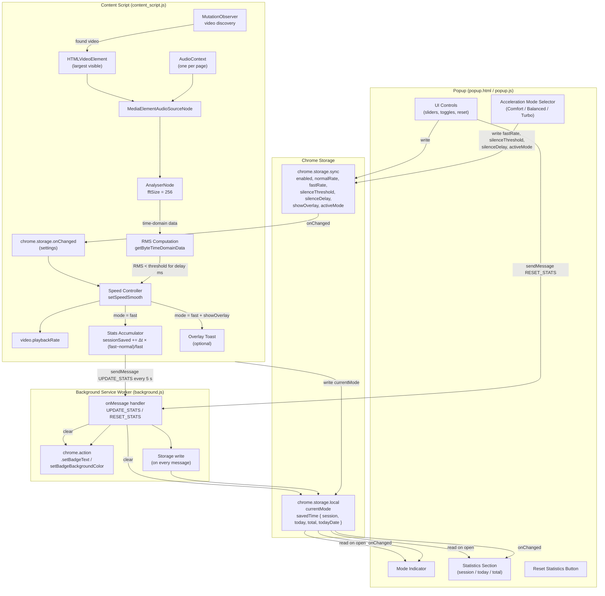

# Architecture

## Table of Contents

- [System Overview](#system-overview)
- [File Structure](#file-structure)
- [Audio Pipeline](#audio-pipeline)
- [Speed Control](#speed-control)
- [Time-Saved Statistics](#time-saved-statistics)
- [Settings Propagation](#settings-propagation)
- [Error Handling](#error-handling)
- [Constraints and Design Decisions](#constraints-and-design-decisions)

## System Overview

The extension has three execution contexts: the **content script**, the **background service
worker**, and the **popup**. The content script and popup never communicate directly — all
coordination passes through `chrome.storage` and `chrome.runtime.sendMessage` via the background.



## File Structure

| File | Responsibility |
| --- | --- |
| `manifest.json` | Extension metadata, permissions (`storage`, `activeTab`), background service worker declaration, content script injection rules, icon declarations |
| `content_script.js` | Audio graph management, RMS analysis loop, speed control, seek reset, time-saved accumulation, stats messaging, optional overlay toast, video discovery, settings listener, page lifecycle cleanup |
| `background.js` | Receives `UPDATE_STATS` and `RESET_STATS` messages; persists statistics to `chrome.storage.local` on every stats message; manages toolbar badge text and colour |
| `popup.html` | Popup markup — toggle, mode indicator, acceleration mode selector (segmented control), five setting controls, reset button, divider, statistics section |
| `popup.js` | Popup logic — reads/writes `chrome.storage.sync`, applies acceleration mode presets, syncs sliders with number inputs, detects preset modifications, updates mode indicator and statistics via `chrome.storage.local`, sends `RESET_STATS` to background |
| `popup.css` | Dark-theme styles for the popup; 320 px fixed width; flat flex layout for slider rows; segmented control styles with per-mode active colours; divider and statistics section styles |
| `generate_icons.js` | Build-time helper that generates `icons/icon{16,48,128}.png` from an SVG source using `sharp` |
| `icons/` | PNG icon assets at three sizes |
| `docs/` | Architecture and configuration reference |

## Audio Pipeline

### AudioContext lifecycle

A single `AudioContext` is created per page the first time a `<video>` element is found. Creating
multiple contexts for the same page would waste OS audio resources and risk hitting browser limits.
The context is shared for the lifetime of the page and is explicitly closed in the `beforeunload`
handler.

Browsers may suspend an `AudioContext` after a period of user inactivity. The analysis loop
checks `audioCtx.state` on every tick and calls `audioCtx.resume()` when suspension is detected.

### Graph topology

```
HTMLVideoElement
      |
      v
MediaElementAudioSourceNode  (created with audioCtx.createMediaElementSource(video))
      |
      v
AnalyserNode  (fftSize = 256, produces 256 bytes of time-domain data)
      |
      v
AudioDestinationNode  (the page's default audio output — sound still plays normally)
```

The `MediaElementAudioSourceNode` is a **tee**: connecting it to the `AnalyserNode` does not
mute or intercept audio; the signal flows through to `AudioDestinationNode` unchanged.

### RMS formula

The `AnalyserNode` provides raw PCM samples as unsigned 8-bit integers in the range [0, 255],
where 128 represents zero amplitude. The content script normalizes each sample to the range
[-1, 1] and computes the Root Mean Square:

```
normalized_i = (sample_i - 128) / 128

RMS = sqrt( (1/N) * sum_{i=0}^{N-1} normalized_i^2 )
```

where N = 256 (the `fftSize`). The result is a dimensionless value in [0, 1]. Audio is considered
silent when `RMS < silenceThreshold`.

## Time-Saved Statistics

### Accumulation formula

On every analysis tick where `currentMode === 'fast'`, the content script increments
`sessionSaved` using the following formula:

```
savedTime += (ANALYSIS_INTERVAL_MS / 1000) × (fastRate − normalRate) / fastRate
```

**Derivation:** in `Δt` seconds of real time, the video advances `Δt × fastRate` seconds of
content. Without the extension, that same content would take `Δt × fastRate / normalRate` seconds
at normal speed. The difference is the time saved:

```
saved = Δt × fastRate / normalRate  −  Δt
      = Δt × (fastRate − normalRate) / normalRate
```

When `normalRate = 1.0` this simplifies to `Δt × (fastRate − 1) / 1`, but the formula above is
used in the code to support non-unit `normalRate` values.

**Note:** the code uses `/ fastRate` rather than `/ normalRate`. This is the correct formula for
computing the savings relative to real elapsed time (how much wall-clock time is saved compared to
watching at normal speed in the same real-time window). The two forms are equivalent when
`normalRate = 1.0`, and the code matches the spec.

### Message flow

```
content_script (every 5 s)
  -> chrome.runtime.sendMessage({
       type:         'UPDATE_STATS',
       sessionSaved: <total seconds saved this page session>,
       delta:        <increment since last send>,
       isFast:       <boolean>
     })
     -> background.js
          -> reads chrome.storage.local.savedTime
          -> adds delta to today + total
          -> writes back to storage immediately
          -> updates badge
```

### Delta approach (why not send the total)

The background service worker is ephemeral in Manifest V3 — the browser terminates it after
approximately 30 seconds of inactivity and restarts it on the next message. If the background
restarted and the content script sent the full `sessionSaved` total, the background would have no
way to know how much of that total was already persisted, risking double-counting.

By computing `delta = sessionSaved − lastSentSaved` in the content script (which has persistent
in-memory state for the page session), the background only ever adds _new_ savings. If the
`sendMessage` call fails, `lastSentSaved` is reverted so the unsent delta is retried on the next
tick.

### Daily rollover

On each `UPDATE_STATS` message the background compares the stored `todayDate` (an ISO date string
`YYYY-MM-DD`) with the current date. If they differ, `today` is reset to zero and `todayDate` is
updated before applying the new delta.

### Badge format

| `sessionSaved` | Badge text | Colour |
| --- | --- | --- |
| 0 | `""` (hidden) | — |
| < 60 s | `"45s"` | `#888888` (grey) |
| ≥ 60 s | `"1:23"` | `#27AE60` (green) if `isFast`, else `#888888` |

### Overlay toast

When `settings.showOverlay` is `true`, `showSavedToast(sessionSaved)` is called each time the
mode transitions to `'fast'`. The toast is a `position: fixed` `<div>` injected into the page
body at `bottom: 60px; right: 20px` with `z-index: 2147483647`. It displays for 2 seconds then
fades out over 0.5 seconds via a CSS `opacity` transition. Only one toast is shown at a time;
a new transition cancels any in-progress toast.

## Speed Control

### Smooth transition algorithm

Changing `video.playbackRate` causes the browser's internal resampler to reset at the Web Audio
render-quantum boundary (~128 samples, ~2.9 ms at 44100 Hz), producing a PCM discontinuity
regardless of how gradually the rate is interpolated in JavaScript. `setSpeedSmooth` eliminates
this by making the rate change while the audio signal is silent:

1. Cancel any in-progress transition (`clearTimeout` on `transitionTimer`).
2. If the difference between the current rate and the target is already less than 0.01, return
   immediately.
3. If the `AudioContext` is not running (cross-origin fallback), assign `playbackRate` directly.
4. Use `AudioParam.linearRampToValueAtTime` to fade `gainNode.gain` from its current value to 0
   over `GAIN_FADE_DURATION_S` (20 ms). `AudioParam` scheduling is sample-accurate and processed
   inside the render quantum — no JavaScript-level discontinuity.
5. After `GAIN_SETTLE_MS` (25 ms), assign `video.playbackRate = targetRate` and restore gain to
   1 over another 20 ms ramp.

The complete cycle is ~45 ms. The rate change happens while the signal is at zero — physically
inaudible.

The analysis loop uses `setInterval` (not `requestAnimationFrame`) for consistent firing when the
tab is backgrounded. Speed transitions use `AudioParam` scheduling which is pipeline-accurate and
does not suffer from `requestAnimationFrame` throttling in background tabs.

### External rate-change detection

The content script records the last rate it set in `lastKnownRate`. On each analysis tick it
compares `video.playbackRate` to `lastKnownRate`. A discrepancy greater than 0.05 indicates an
external change (user interaction, another extension, or the page's own player controls). When
this is detected, the analysis loop stops and does not resume for the current page session.

### Seek handling

When the user scrubs the video, the browser fires `seeking` (start of seek) followed by `seeked`
(seek complete). Without explicit handling, the silence detector would inherit stale state: a
`silenceSince` timestamp from before the seek could cause an immediate fast-mode trigger at the
new position even if speech is present.

`seeking` handler:
1. Set `isSeeking = true` — the analysis loop returns early on every tick while this flag is set.
2. Cancel any in-progress gain ramp and restore `gainNode.gain` to 1 immediately. A seek already
   disrupts the audio pipeline, so no fade is needed and leaving gain at 0 would cause silence
   after the seek completes.
3. If `currentMode === 'fast'`, assign `playbackRate = normalRate` directly (no gain fade — audio
   is already disrupted) and notify the popup via `chrome.storage.local`.

`seeked` handler:
1. Reset `silenceSince = null` — the silence timer restarts clean at the new position.
2. Set `isSeeking = false` — the analysis loop resumes on the next tick.

Handlers are attached in `startAnalysis` and removed in `stopAnalysis`. This prevents stale
listeners from accumulating when the targeted video element is replaced by a different one.

## Settings Propagation

### Popup to content script

```
User adjusts a control in the popup
  -> popup.js calls chrome.storage.sync.set(settings)
    -> chrome.storage.onChanged fires in content_script.js
      -> settings[key] = newValue applied immediately
        -> if enabled became false: resetSpeed() is called
```

Changes are visible to the content script within one event loop cycle after the storage write.
The popup reads current settings once on open (`chrome.storage.sync.get`) and then writes
incrementally on each control interaction.

### Acceleration mode selection

```
User clicks a mode button (Comfort / Balanced / Turbo)
  -> popup.js applies preset values (fastRate, silenceThreshold, silenceDelay)
  -> popup.js sets activeMode = selected mode
  -> chrome.storage.sync.set(settings) — four keys written in one call
    -> chrome.storage.onChanged fires in content_script.js
      -> fastRate, silenceThreshold, silenceDelay applied immediately
      (activeMode is not read by content_script.js)
    -> popup.js re-renders sliders, number inputs, and mode buttons

User adjusts fastRate / silenceThreshold / silenceDelay manually after selecting a mode
  -> popup.js detects divergence from preset in renderModeBtns()
  -> active mode button gains '•' prefix (no storage write for this state)

User clicks the '•'-prefixed active mode button
  -> popup.js re-applies the preset (same flow as initial mode selection)
  -> '•' prefix is removed
```

`activeMode` is a popup-only preference. The content script reads `fastRate`,
`silenceThreshold`, and `silenceDelay` directly and has no knowledge of `activeMode`.

### Mode reporting (content script to popup)

```
content_script.js detects a mode change (normal -> fast or fast -> normal)
  -> chrome.storage.local.set({ currentMode: 'fast' | 'normal' })
    -> chrome.storage.onChanged fires in popup.js (if popup is open)
      -> updateModeIndicator() re-renders the mode badge
```

### Statistics reporting (content script → background → popup)

```
content_script.js accumulates sessionSaved on each fast-mode tick
  -> every 5 s: chrome.runtime.sendMessage(UPDATE_STATS)
    -> background.js writes chrome.storage.local.savedTime immediately
    -> background.js updates toolbar badge
      -> chrome.storage.onChanged fires in popup.js (if popup is open)
        -> renderStats() updates the three counter rows
```

### Statistics reset (popup → background)

```
User clicks "Reset statistics" and confirms
  -> popup.js calls chrome.runtime.sendMessage(RESET_STATS)
    -> background.js writes zeroed savedTime to chrome.storage.local immediately
    -> background.js clears the toolbar badge
      -> chrome.storage.onChanged fires in popup.js
        -> renderStats() updates counters to "—"
```

`chrome.storage.local` is used for runtime state (mode, statistics) because it is device-local
(not synced), has a larger quota than `sync`, and does not require the user to be signed in.

## Error Handling

### SecurityError (CORS / DRM)

When `audioCtx.createMediaElementSource(video)` is called on a cross-origin or DRM-protected
video, Chrome throws a `SecurityError`. The content script catches this, sets the
`isCrossOriginBlocked` flag, tears down any partial audio graph, and shows a dismissible
notification banner that auto-removes after 6 seconds. Speed control is not attempted for that
video element.

### AudioContext suspension

Browsers suspend `AudioContext` instances to conserve power. The suspension is not an error —
it is handled by calling `audioCtx.resume()` at the start of each analysis tick whenever
`audioCtx.state === 'suspended'`.

### Page unload cleanup

The `beforeunload` event handler:

1. Disconnects the `MutationObserver` to prevent callbacks on a tearing-down DOM.
2. Calls `flushStats()` to send any unsent savings delta to the background before the page tears
   down. This ensures the final segment of fast-mode playback is not lost.
3. Calls `stopAnalysis()` to cancel both the analysis and transition timers.
4. Calls `closeAudioContext()` to disconnect the audio graph nodes and call `audioCtx.close()`,
   releasing the OS audio handle.

Failing to close the `AudioContext` would leave a dangling handle that counts against the
browser's per-page audio context limit.

## Constraints and Design Decisions

### Single AudioContext per page

The Web Audio API imposes an implicit limit on simultaneous `AudioContext` instances. Creating
a new context each time a new video is found would exhaust this limit on pages with many videos
(e.g., a playlist page). The single shared context is reused across video switches; only the
`MediaElementAudioSourceNode` is recreated when the target video changes.

### setInterval over requestAnimationFrame (analysis loop)

`requestAnimationFrame` throttles to 0 Hz when the tab is not visible, which would prevent
silence detection while the user works in another tab. `setInterval` continues firing at its
configured interval regardless of tab visibility. The 75 ms interval is short enough for
responsive detection without meaningful CPU overhead.

Speed transitions (`setSpeedSmooth`) are the one exception: they use `requestAnimationFrame`
because the 150 ms ramp is inherently user-visible and benefits from synchronisation with the
browser's render/audio pipeline. A backgrounded tab will not produce audible clicks regardless,
so the throttling behaviour of `requestAnimationFrame` is not a concern for transitions.

### MutationObserver for video discovery

Modern video platforms (YouTube, Vimeo, Netflix) are single-page applications that insert
`<video>` elements dynamically long after `document_idle`. A one-time DOM query at injection time
would miss these elements. `MutationObserver` on `document.documentElement` with `subtree: true`
catches every DOM insertion without polling, at negligible cost when no mutations are occurring.

### Delta-based stats vs. cumulative total

Sending only the increment (`delta`) to the background on each message, rather than the full
running total, decouples the content script from the background service worker lifecycle. The
background in Manifest V3 is ephemeral — it may be terminated and restarted at any time. A fresh
background process has no memory of what was already persisted. If the content script sent the
full `sessionSaved` total, the background could not distinguish "new savings" from "already
written savings" and would double-count on every restart.

By computing `delta = sessionSaved − lastSentSaved` inside the content script (which has stable
in-process memory for the page session), the background simply adds whatever delta it receives.
The worst case on a service-worker restart is that one 5-second batch is lost if `sendMessage`
fails during the restart. This is accepted.

### Storage writes on every stats message

`chrome.storage.local.set` is called on every `UPDATE_STATS` message (every 5 seconds per active
tab). This keeps `savedTime` in storage current so the popup always reads accurate values when
opened. A previous 10-second debounce was removed because it caused the popup to display `—` for
all counters — the popup read from storage before the debounced write ever fired.
